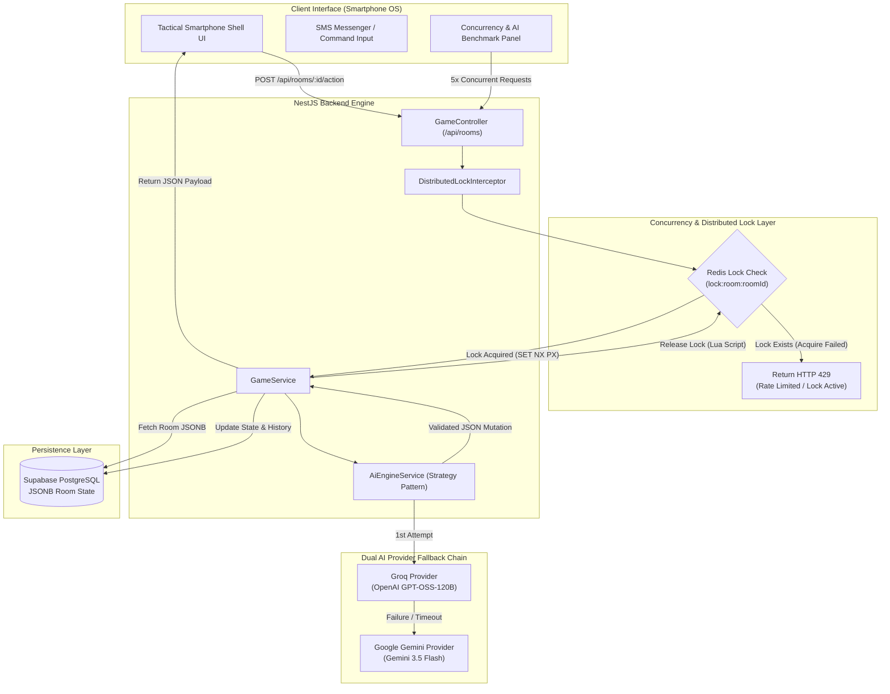
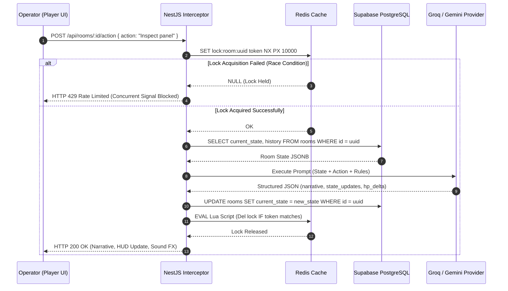

# AEGIS OS v5.0 — AI-Driven Escape Room Engine

Live Production Deployment: [https://aiescaperoom.onrender.com](https://aiescaperoom.onrender.com)  
Author & Maintainer: [Berkawaii (Berkay Acar)](https://github.com/Berkawaii/Berkawaii)

---

## 1. Executive Summary & Vision

AEGIS OS is an enterprise-grade, low-latency escape room simulation platform powered by Large Language Models (LLM) and a dynamic NestJS State Machine architecture. Instead of relying on pre-scripted static branching trees, the engine uses structured prompt engineering and JSONB state mutations to generate infinite, context-aware survival scenarios in real time.

The player interacts through a tactical smartphone interface, acting as a remote Operator guiding Field Agent Alex via encrypted SMS. To guarantee data consistency under heavy user interaction, the backend implements atomic Distributed Locking via Redis, immediately blocking concurrent race conditions with HTTP 429 responses.

---

## 2. Live Application Link

The engine is deployed and live at:
[https://aiescaperoom.onrender.com](https://aiescaperoom.onrender.com)

Key features available in live production:
- Four Distinct Tactical Scenarios (Cyberpunk Escape, Haunted Detective Manor, Abandoned Sci-Fi Base, Medieval Dungeon)
- Dual AI Engine Strategy (Groq OpenAI GPT-OSS-120B for sub-second responses + Google Gemini 3.5 Flash for fallback and reasoning)
- In-Phone OS Applications (SMS Messenger, Mission Control, Agent Equipment & Health, PostgreSQL JSONB State Inspector, Concurrency & AI Latency Benchmark, Photos Field Snapshots Gallery)
- Multi-Stage Inactivity Nudge & Automatic Mission Failure Lockout
- Dynamic Dual Language Support (English / Turkish)

---

## 3. Core System Architecture

The following Mermaid diagram outlines the end-to-end execution flow from the client smartphone UI to the Redis Lock layer, NestJS State Machine, Supabase PostgreSQL, and LLM Provider API.



---

## 4. Sequence Diagram — Action Execution & Atomic Lock Cycle



---

## 5. Technology Stack

### Backend & Infrastructure
- Framework: NestJS (TypeScript)
- Database: Supabase PostgreSQL with native JSONB column formatting for room states
- Cache & Concurrency: Redis (ioredis) for distributed locking (`SET NX PX`) and Lua script lock release
- Production Hosting: Render PaaS (`https://aiescaperoom.onrender.com`)

### Artificial Intelligence Strategy
- Primary Provider: Groq SDK (`openai/gpt-oss-120b`) for sub-second SMS response latency
- Fallback Provider: Google Generative AI (`gemini-3.5-flash`) for complex evaluation and automatic failover
- Visual Snapshot Engine: Procedural Pollinations.ai text-to-image integration triggered on explicit visual user requests

### Frontend & UI Engineering
- Architecture: Vanilla HTML5 / Modern CSS3 / JavaScript (ES2023) Single-Page Smartphone OS
- Aesthetics: Tactical Cyberpunk / Dark Mode with glassmorphism, scanlines, and haptic frame vibration
- Internationalization: Native real-time language switcher (`English` / `Turkish`)

---

## 6. Key Features & In-Phone OS Applications

### 1. SMS Messenger App
Encrypted messaging interface with Field Agent Alex. Features real-time AI typing indicator animations (`Field Agent Alex is typing...`), sound effects, and dynamic suggested action pills.

### 2. Multi-Stage Inactivity Nudge & Auto-Failure Lockout
If the player stops responding after starting a mission, the system advances through four automated stages:
- Stage 1 (35s): Gentle agent reminder.
- Stage 2 (25s): Radio noise and urgent check-in.
- Stage 3 (20s): Critical warning regarding fading telepathic signal.
- Stage 4 (20s): Signal lost, agent captured, HP set to 0, mission marked as FAILED. The input interface is permanently locked until a new mission is initialized from Mission Control.

### 3. Mission Control & Scenario Selector
Enables scenario selection across four distinct environments with custom system prompts:
- Cyberpunk Escape (Neo-Tokyo 2142)
- Haunted Detective Manor (Blackwood 1920)
- Abandoned Sci-Fi Base (LV-426)
- Medieval Dungeon (Castle Cell)

### 4. Photos Field Snapshots Gallery
Dedicated photos application archiving all procedural high-resolution field photos captured during agent exploration. Includes full-screen lightbox preview support and pre-loaded tactical artwork.

### 5. PostgreSQL JSONB State Inspector
Real-time state scanner displaying live JSONB data structures directly from the Supabase database.

### 6. Concurrency & AI Latency Benchmark App
Built-in testing suite allowing developers to:
- Fire 5 simultaneous requests to test Redis Distributed Lock protection (HTTP 429 verification).
- Benchmark AI model latency (in ms) and inference performance live for Groq and Gemini.

---

## 7. API Specification

### 1. Initialize New Mission Room
- Endpoint: `POST /api/rooms`
- Payload:
```json
{
  "theme": "cyberpunk_escape",
  "lang": "en"
}
```
- Response (HTTP 201):
```json
{
  "id": "1799112c-41fc-4809-ba71-6f0e1704be57",
  "theme": "cyberpunk_escape",
  "current_state": {
    "health": 100,
    "inventory": [],
    "environment": {
      "steel_door": "locked",
      "maintenance_panel": "sealed"
    }
  },
  "status": "active"
}
```

### 2. Execute Operator Action
- Endpoint: `POST /api/rooms/:id/action`
- Payload:
```json
{
  "action": "Inspect the maintenance panel symbols",
  "lang": "en",
  "provider": "auto"
}
```
- Response (HTTP 200):
```json
{
  "narrative": "I closely examine the maintenance panel...",
  "state": {
    "health": 100,
    "inventory": ["maintenance_key"],
    "environment": { "maintenance_panel": "opened" }
  },
  "suggestedActions": ["Use key on panel", "Check wiring"],
  "providerUsed": "Groq (OpenAI GPT-OSS-120B)",
  "imageUrl": null,
  "soundEffect": "drawer_open"
}
```

---

## 8. Local Setup & Execution Instructions

### Prerequisites
- Node.js (v20+ recommended)
- npm or yarn
- Redis Server (local or cloud instance)
- Supabase PostgreSQL instance

### Environment Configuration (.env)
Create a `.env` file in the root directory:

```env
PORT=3001

# Supabase Production Database
SUPABASE_URL=https://your-supabase-id.supabase.co
SUPABASE_SERVICE_ROLE_KEY=your-supabase-service-role-key

# Redis Configuration
REDIS_HOST=127.0.0.1
REDIS_PORT=6379

# AI Provider Keys
GROQ_API_KEY=your-groq-api-key
GROQ_MODEL=openai/gpt-oss-120b

GEMINI_API_KEY=your-gemini-api-key
GEMINI_MODEL=gemini-3.5-flash

PRIMARY_AI_PROVIDER=groq
```

### Installation and Run Commands
```bash
# 1. Install dependencies
npm install

# 2. Build production assets
npm run build

# 3. Start production server
npm run start:prod
```

The application will be accessible at `http://localhost:3001`.

---

## 9. License

This project is licensed under the MIT License.